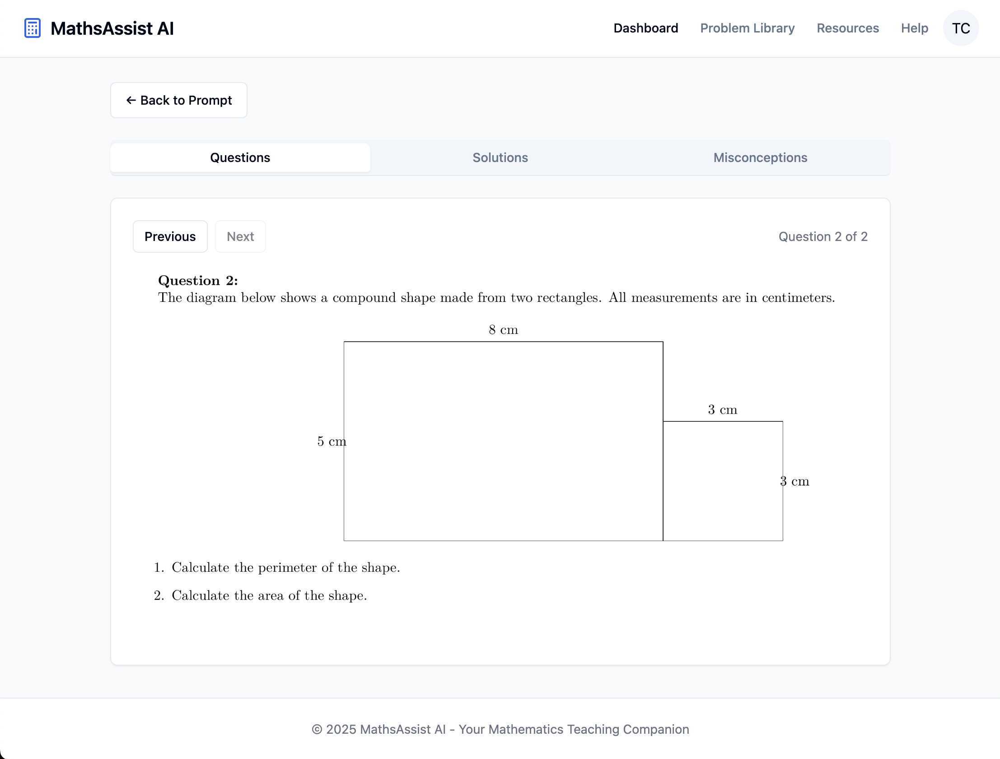
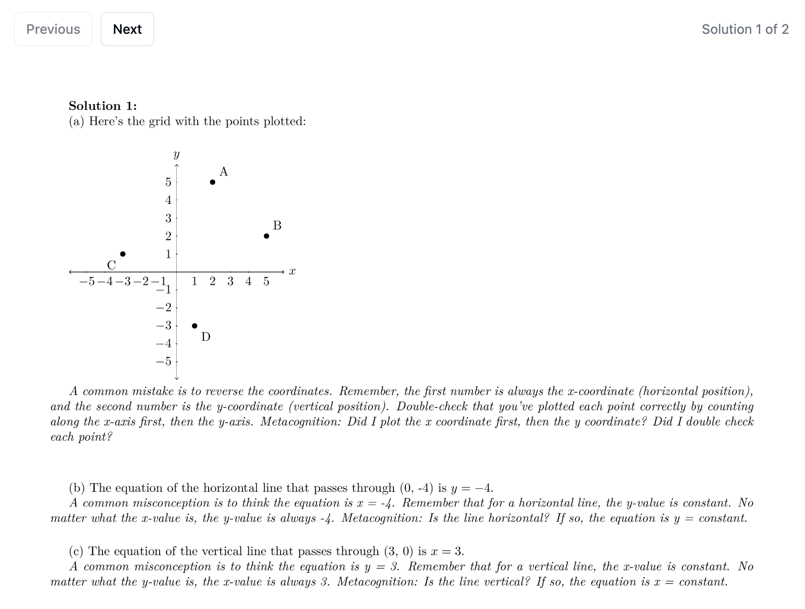
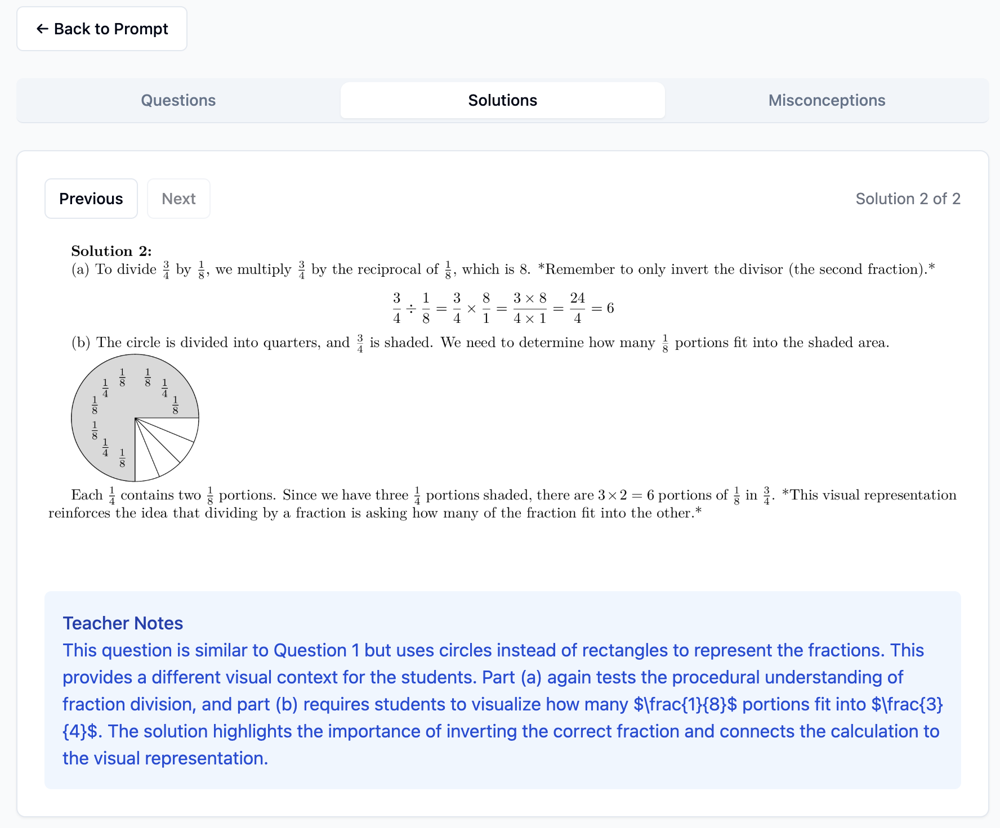
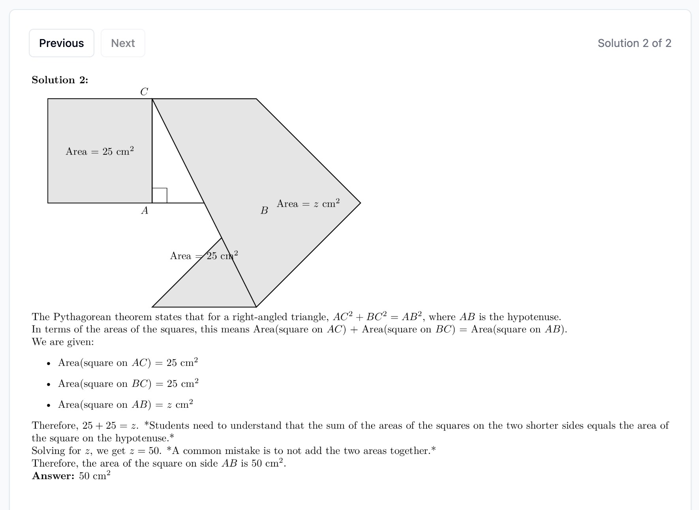
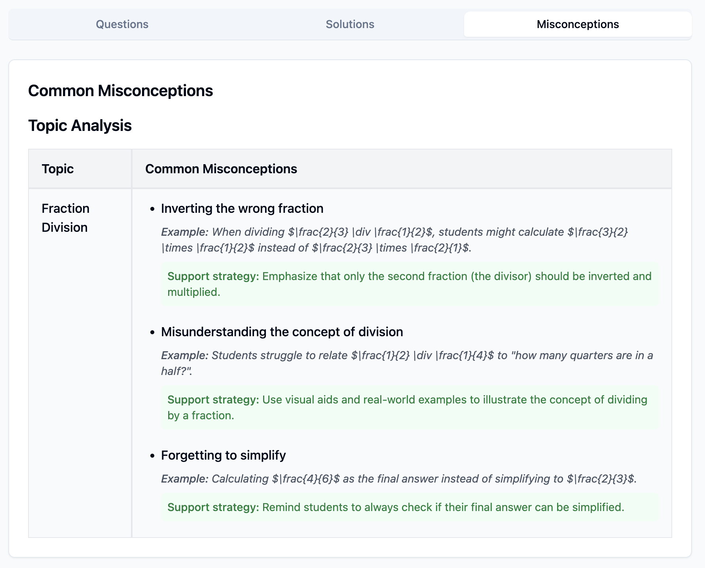

# MathsAssist AI

A React application that generates custom KS3 mathematics questions with visual elements powered by AI. MathsAssist AI uses an LLM (Gemini 2 Flash) with few-shot prompting to to create visual representations of math problems with step-by-step solutions in Tikz, helping teachers identify and address common misconceptions.

---

## ✨ Features

- **AI-Powered Question Generation**: Creates custom KS3 math questions based on specific topics and skills.
- **Visual Math Elements**: Generates TikZ/LaTeX diagrams for topics like Pythagoras theorem, geometric shapes, and division chunking.
- **Step-by-Step Solutions**: Provides detailed visual breakdowns of how to answer each question.
- **Misconception Analysis**: Identifies common student misconceptions for each math topic with remediation strategies.
- **LaTeX Rendering**: Real-time rendering of LaTeX/TikZ content via a backend compilation service.
- **Interactive Interface**: Clean, modern UI with tabs for questions, solutions, and misconceptions.

---

## 🖼 Examples

MathsAssist AI can generate a variety of mathematical visualisations to assist with teaching. Here are some examples of the types of content it can create:

| Description                  | Example                                                                                     |
| ---------------------------- | ------------------------------------------------------------------------------------------- |
| Application Homepage         |            |
| Area and Perimeter           |   |
| Coordinate Geometry Solution |         |
| Fraction Operations          |      |
| Complex Pythagoras           |       |
| Misconceptions Analysis      |  |

---

## 📦 Requirements

- Node.js 18.0+
- React 19.0+
- Gemini API key (for AI-powered content generation)
- Local TikZ rendering service (for LaTeX/TikZ compilation)
- Misconceptions from the Department for Education content store (optional)

### Dependencies

- **UI Framework**: React 19 with TypeScript
- **Styling**: TailwindCSS
- **Math Rendering**: KaTeX, react-katex
- **Icons**: Lucide React
- **UI Components**: Radix UI primitives

### Installation

```bash
# Clone the repository
git clone https://github.com/OpenKit-Ltd/maths-assist.git
cd maths-assist

# Install dependencies
npm install

# Create .env file with your Gemini API key
echo "VITE_GEMINI_API_KEY=your_api_key_here" > .env
```

### TikZ Rendering Backend

MathsAssist AI requires a backend service to compile LaTeX/TikZ code into images. The application uses [OpenKit's TikZ Renderer](https://github.com/OpenKit-Ltd/tikz-renderer), an open-source solution for compiling TikZ code into PNG images.

The backend service should be running on `http://localhost:5000` with a `/compile` endpoint that accepts JSON with the format:

```json
{
  "tikz_code": "\\begin{tikzpicture}\\draw (0,0) -- (1,1);\\end{tikzpicture}",
  "format": "png"
}
```

---

## 🚀 Usage

### 1. Start the Development Server

```bash
npm run dev
```

### 2. Access the Application

Open your browser and navigate to:

```
http://localhost:5173/
```

### 3. Generate Math Content

1. **Enter a prompt** describing the math topic or concepts you want to generate questions for:

   Example prompts:

   - "Generate questions about Pythagorean theorem for Year 8 students"
   - "Create practice problems for area and perimeter calculations"
   - "Make division chunking examples with visual breakdowns"

2. **Toggle Content Store** option if you want to include predefined misconceptions

3. **Click Send** and wait for the AI to generate content

4. **Navigate the results** using the tabs for Questions, Solutions, and Misconceptions

### 4. Viewing and Saving Content

- Use the **Questions** tab to view generated questions with visual elements
- Use the **Solutions** tab to see step-by-step solutions with explanations
- Use the **Misconceptions** tab to see common misconceptions and remediation strategies

---

## 🧠 How It Works

1. **User Input Processing**:

   - The application takes a teacher's request for specific math topics
   - It formulates a comprehensive prompt for the Gemini AI model

2. **Content Generation**:

   - The Gemini AI generates structured content including questions, solutions, and misconceptions
   - Content is created with LaTeX/TikZ code for visual elements

3. **Response Parsing**:

   - The application parses the AI response, extracting structured data for:
     - Topic information
     - Question content with LaTeX/TikZ code
     - Step-by-step solutions with explanations
     - Misconception analysis with remediation strategies

4. **LaTeX/TikZ Rendering**:

   - LaTeX content is sent to the backend TikZ renderer service
   - The service compiles the code and returns PNG images
   - Images are cached to improve performance on repeated viewings

5. **Interactive Display**:
   - Content is organized into tabbed sections for easy navigation
   - Teachers can browse questions, view detailed solutions, and review misconceptions

---

## ⚠️ Notes & Known Issues

- The application requires an active internet connection to access the Gemini AI API.
- The TikZ rendering backend must be running for visual elements to display properly.
- Large or complex TikZ diagrams may take longer to render.
- For optimal results, be specific about the math concepts, student level, and desired outcomes in your prompts.
- **Content Store Toggle**: The 'Include Content Store Misconceptions' toggle in the UI is non-functional by default, as Department for Education content store-specific prompts have been excluded due to licensing restrictions. The prompt is still included in the code but any DfE content has been removed.
- **TikZ Rendering**: Sometimes the Gemini 2 Flash model generates flawed TikZ code which fails to render properly. Rerunning the prompt typically fixes this issue.

---

## 🔒 Security Concerns

**IMPORTANT: This application is intended for local testing ONLY.**

The current implementation makes direct API calls to the Gemini AI service from the frontend, which is **NOT secure** for production use as it:

1. Exposes your API key in browser network requests
2. Makes your API key visible in browser developer tools/logs
3. Provides no protection against quota abuse or unauthorised access

This approach was chosen for ease of experimentation and to reduce the number of additional codebases required during development.

---

## 🔧 Development Information

### React + TypeScript + Vite

This project is built using the Vite build tool with React and TypeScript. Vite provides a minimal setup with Hot Module Replacement (HMR) for fast development.

#### Vite Plugins

The project uses the official Vite plugin for React:

- [@vitejs/plugin-react](https://github.com/vitejs/vite-plugin-react/blob/main/packages/plugin-react/README.md) uses [Babel](https://babeljs.io/) for Fast Refresh

#### ESLint Configuration

The project includes a basic ESLint configuration. If you're developing a production application, you may want to expand the configuration to enable type-aware lint rules:

```js
export default tseslint.config({
  extends: [
    // Remove ...tseslint.configs.recommended and replace with this
    ...tseslint.configs.recommendedTypeChecked,
    // Alternatively, use this for stricter rules
    ...tseslint.configs.strictTypeChecked,
    // Optionally, add this for stylistic rules
    ...tseslint.configs.stylisticTypeChecked,
  ],
  languageOptions: {
    // other options...
    parserOptions: {
      project: ["./tsconfig.node.json", "./tsconfig.app.json"],
      tsconfigRootDir: import.meta.dirname,
    },
  },
});
```

#### Additional React Linting Plugins

You can also enhance the project with React-specific lint rules by installing:

- [eslint-plugin-react-x](https://github.com/Rel1cx/eslint-react/tree/main/packages/plugins/eslint-plugin-react-x)
- [eslint-plugin-react-dom](https://github.com/Rel1cx/eslint-react/tree/main/packages/plugins/eslint-plugin-react-dom)

And configuring them in your eslint.config.js:

```js
// eslint.config.js
import reactX from "eslint-plugin-react-x";
import reactDom from "eslint-plugin-react-dom";

export default tseslint.config({
  plugins: {
    // Add the react-x and react-dom plugins
    "react-x": reactX,
    "react-dom": reactDom,
  },
  rules: {
    // other rules...
    // Enable its recommended typescript rules
    ...reactX.configs["recommended-typescript"].rules,
    ...reactDom.configs.recommended.rules,
  },
});
```

---

## 📜 License

MIT License

---

Made with ❤️ by Reuben McQueen at [OpenKit](https://openkit.co.uk)
